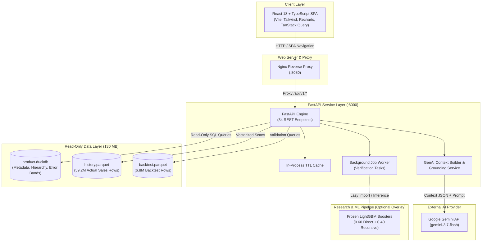

# Retail Demand Forecasting & AI Forecast Assistant

> **NPN AIA Hackathon — Cognizant Use Case 11**<br/>
> *Hierarchical 28-Day Demand Forecasting for 30,490 Walmart Store-Item Series with a Grounded Gemini Explanatory Assistant.*

---

## Overview

**Retail Demand Forecasting** is an end-to-end machine learning and software solution designed for enterprise retail supply chain planning. Built on the public **Walmart M5 Forecasting dataset**, the system generates 28-day-ahead daily unit sales forecasts across **30,490 distinct store-item time series** (3,049 products across 10 stores in California, Texas, and Wisconsin).

The core engine utilizes a frozen **LightGBM Tweedie ensemble** combining direct 28-day multi-horizon forecasting with 1-step recursive rollout models. To make complex econometric metrics understandable to non-technical store managers and inventory planners, the system integrates a **Gemini-powered GenAI Forecast Assistant** that answers natural language inquiries with zero hallucinated figures through strict backend context grounding.

### Problem Addressed
In retail operations, improper demand forecasting leads directly to stockouts (lost revenue) or excess inventory (tied-up capital and spoilage). Retail demand series present severe modeling challenges:
- **Intermittent Demand**: 68% of historical store-item-day combinations contain zero sales.
- **Hierarchical Coherence**: Planning occurs at multiple aggregation levels (Store-Item, Category, Department, Store, State, Chain).
- **Missing Operational Signals**: Standard datasets lack explicit stockout or promotion indicators, requiring models to distinguish between zero customer demand vs zero product availability without fabricating causal assumptions.

### Key Target Users
- **Inventory & Supply Chain Planners**: Requiring 28-day stock movement forecasts and 12-level hierarchical rollups.
- **Store Managers**: Needing intuitive insights into rising/falling products, demand regime classifications (Syntetos-Boylan), and empirical uncertainty bands.
- **Executive Leadership**: Requiring transparent validation metrics across 8 backtest windows and clear AI-generated natural language executive summaries.

---

## Problem Statement

Predict daily unit sales $y_{s, t}$ for all $s \in \{1, \dots, 30490\}$ store-item series for a 28-day forecast horizon ($d\_1942$ to $d\_1969$), given 1,941 days ($\sim 5.3$ years) of historical daily sales data ($d\_1$ to $d\_1941$).

**Core Challenges:**
1. **High Intermittency**: 40,241,819 out of 59,181,090 total daily observations (68.00%) are zero sales.
2. **Asymmetric Error Penalties**: Standard MSE loss penalizes zero-inflated target distributions incorrectly.
3. **Data Scale**: 59.2 million historical rows requiring high-throughput data processing and low-latency storage.
4. **Model Safety & Explainability**: Preventing machine learning models from making economically invalid predictions when probed with price variations, and guarding AI assistants from hallucinating inventory numbers.

---

## Proposed Solution

1. **Frozen LightGBM Tweedie Blend**:
   A deterministic ensemble blending two complementary architectures:
   - **Member A (Direct)**: LightGBM model trained on 38 features with direct 28-day horizon targets ($w = 0.60$).
   - **Member B (Recursive)**: LightGBM 1-step-ahead model trained on 32 features, rolled forward 28 steps ($w = 0.40$).
   - Objective: `tweedie` loss with variance power $p = 1.1$, specifically engineered for zero-inflated count data.

2. **Ultra-Fast Portable Data Layer**:
   Replaces slow, heavy raw files with a **130 MB optimized product data layer**:
   - `data/product.duckdb` (19.9 MB): Pre-aggregated forecasts, series metadata, 12-level hierarchy, empirical error bands, and model cards.
   - `data/history.parquet` (31.7 MB): 59.2M rows of historical sales, sorted for $8\text{ ms}$ single-series extraction.
   - `data/backtest.parquet` (78.4 MB): 6.8M rows across 8 historical ground-truth backtest windows.

3. **Production FastAPI Service**:
   A lightweight, 34-route API built with DuckDB and Pydantic. Isolates research code to prevent filesystem side effects during container execution, allowing cold starts in $< 1\text{ second}$.

4. **Modern React + TypeScript Dashboard**:
   A single-page application built with Vite, Tailwind CSS, Recharts, and TanStack Query, presenting interactive 28-day trend lines, 12-level hierarchy rollups, Syntetos-Boylan demand regime classification, and backtest accuracy breakdowns.

5. **Grounded AI Forecast Assistant**:
   A GenAI layer using Google's `google-genai` SDK (`gemini-3.7-flash`). It retrieves structured backend context JSON ($5\text{--}9\text{ KB}$), generates human-readable explanations, and performs post-generation validation to verify that every quoted number traces back to backend empirical data.

---

## Key Features

- **28-Day Hierarchical Demand Forecasting**: Coherent rollups across all 12 M5 aggregation levels (Item, Department, Category, Store, State, Total Chain).
- **Empirical Uncertainty Bands**: Horizon-dependent error bands (P10 to P90) derived from 853,720 held-out historical predictions rather than parametric Gaussian assumptions.
- **Syntetos-Boylan Demand Classification**: Automatic categorization of time series into *Smooth*, *Erratic*, *Intermittent*, and *Lumpy* demand regimes based on average inter-demand interval (ADI) and squared coefficient of variation ($CV^2$).
- **Multi-Window Backtesting & Validation**: Interactive inspection of model performance across 8 historical backtest windows (including Spring 2016, Christmas 2015, Summer 2015, Autumn 2015).
- **Live Model Verification**: Worker-backed background execution endpoint (`POST /api/v1/inference/verify`) that re-executes the frozen LightGBM model pipeline ($\sim 48\text{ s}$) and verifies hash integrity against canonical model binaries.
- **Grounded GenAI Explanatory Layer**: Natural language Q&A interface with prompt injection defense, key security (keys stay on the backend container), and automated numerical provenance auditing.
- **Zero-Dependency Production Deployment**: Dual Docker targets (`api` for lean 130MB deployment, `full` for live model inference capability) with Nginx reverse proxy and GitHub Actions CI workflow.

---

## System Architecture



---

## Technology Stack

| Layer | Technology | Version / Specification | Purpose |
|---|---|---|---|
| **Frontend UI** | React | 18.3 | User interface component framework |
| | TypeScript | 5.5 | Type safety across API responses & UI components |
| | Vite | 5.4 | High-performance build tool & development server |
| | Tailwind CSS | 3.4 | Responsive, utility-first UI styling |
| | Recharts | 2.12 | Composability for time-series forecast visuals |
| | TanStack Query | 5.56 | Asynchronous client data caching and management |
| **Backend API** | FastAPI | 0.115 | High-performance Python async REST web framework |
| | Uvicorn | 0.30 | ASGI web server |
| | Pydantic | 2.8 | Request & response schema validation |
| | DuckDB | 1.1 | Embedded OLAP database engine for rapid aggregations |
| | PyArrow | 17.0 | High-speed columnar Parquet data access |
| **Machine Learning** | LightGBM | 4.5 | Gradient boosting framework with Tweedie objective |
| | NumPy / Pandas | 2.1 / 2.2 | Numerical computing & feature engineering |
| **GenAI / LLM** | Google GenAI SDK | `google-genai` 2.18 | Official Google Gemini SDK |
| | Model Target | `gemini-3.7-flash` | Fast-tier LLM for grounded forecast explanations |
| **Infrastructure** | Docker & Compose | 2.x | Multi-stage container orchestration |
| | Nginx | 1.27 (Alpine) | Static asset server & reverse proxy |
| | GitHub Actions | Workflows | Automated CI testing & OIDC deployment checks |
| | Python CLI | `tasks.py` | Cross-platform task runner (Windows / macOS / Linux) |

---

## Project Structure

```text
npn-hackathon-project/
├── backend/                        # FastAPI Backend Application
│   ├── app/
│   │   ├── routers/                # REST API Endpoint Handlers (34 routes)
│   │   │   ├── accuracy.py         # Backtest & validation metrics endpoints
│   │   │   ├── genai.py            # GenAI assistant endpoints & grounding
│   │   │   ├── health.py           # Liveness (/health) & readiness (/ready)
│   │   │   ├── hierarchy.py        # 12-level hierarchy rollups & search
│   │   │   ├── inference.py        # Model status & background verification
│   │   │   ├── insights.py         # Top movers & planning insights
│   │   │   ├── meta.py             # Model card & system capabilities
│   │   │   └── series.py           # Series forecast, history, & error bands
│   │   ├── schemas/                # Pydantic data schemas
│   │   ├── services/               # Core SQL and domain logic
│   │   │   ├── genai.py            # Gemini provider & grounding checks
│   │   │   ├── genai_context.py    # Structured context builder
│   │   │   └── inference.py        # Lazy ML pipeline loader
│   │   ├── cache.py                # In-process TTL cache
│   │   ├── config.py               # Application configuration & env vars
│   │   ├── db.py                   # DuckDB access layer (read-only)
│   │   └── main.py                 # FastAPI application instantiation
│   ├── data/                       # Product data layer (Generated via tasks.py build-db)
│   │   ├── product.duckdb          # 19.9 MB metadata & aggregated tables
│   │   ├── history.parquet         # 31.7 MB actual sales history (59.2M rows)
│   │   └── backtest.parquet        # 78.4 MB ground-truth backtest predictions
│   ├── Dockerfile                  # Multi-stage API Docker container definition
│   ├── openapi.json                # Generated OpenAPI specification
│   └── requirements.txt            # Core backend dependencies
├── frontend/                       # React + TypeScript Frontend Application
│   ├── src/
│   │   ├── api/                    # Typed API client functions
│   │   ├── components/             # UI components & floating AI launcher
│   │   ├── pages/                  # 9 Application routes/pages
│   │   │   ├── Assistant.tsx       # GenAI Assistant interface
│   │   │   ├── Forecast.tsx        # Series forecast & planning viewer
│   │   │   ├── Hierarchy.tsx       # 12-level tree rollup drilldown
│   │   │   ├── Insights.tsx        # Portfolio top movers & summary
│   │   │   ├── Overview.tsx        # Executive summary dashboard
│   │   │   └── ...                 # Accuracy, Validation, Model, Methodology
│   │   ├── App.tsx                 # Main application routes
│   │   └── main.tsx                # Entry point
│   ├── Dockerfile                  # Multi-stage Frontend Nginx container definition
│   ├── nginx.conf                  # Nginx proxy & caching rules
│   └── package.json                # Frontend NPM dependencies
├── infra/                          # Operations & DevOps Tooling
│   ├── compose/                    # Docker Compose production overlays
│   └── scripts/                    # Preflight checks & smoke test suites
├── research/                       # ML Engineering & Experimentation Pipeline
│   ├── models/champion/            # Frozen LightGBM model binaries
│   ├── pipeline/                   # Feature extraction & training code
│   └── predictions/                # Shipped forecast output arrays
├── docs/                           # Comprehensive 11-part Documentation System
│   ├── 01_PROJECT_OVERVIEW/        # Problem statement & executive summary
│   ├── 02_MODEL/                   # Model freeze specification & metrics
│   ├── 04_ARCHITECTURE/            # System architecture & data flow
│   ├── 05_BACKEND/                 # Backend implementation reports
│   ├── 06_FRONTEND/                # Frontend implementation reports
│   ├── 07_GENAI/                   # GenAI assistant architecture & safety
│   ├── 08_DEPLOYMENT/              # Docker & production setup guides
│   └── ...                         # Data, Research, Validation, Submission
├── docker-compose.yml              # Base Docker Compose configuration
├── docker-compose.inference.yml    # Live inference Docker Compose overlay
├── Makefile                        # CLI shortcut commands
├── tasks.py                        # Cross-platform python automation script
├── TEAM.md                         # Team roles & contributors
└── README.md                       # Main project documentation
```

---

## Machine Learning / Data Pipeline

### 1. Dataset Overview
- **Source**: Public Walmart M5 Forecasting Dataset.
- **Series Count**: 30,490 store-item combinations (3,049 products $\times$ 10 stores).
- **Time Range**: 1,941 days ($d\_1$ to $d\_1941$, 2011-01-29 to 2016-05-22).
- **Total Historical Observations**: 59,181,090 long-format rows.
- **Known Covariates**: Calendar dates, day-of-week, national/cultural/religious events, SNAP benefits (per state: CA, TX, WI), and weekly `sell_price`.

### 2. Feature Engineering
Features are organized into 7 functional groups:
1. **Calendar (A)**: Day of week, month, year, event type flags, SNAP indicator.
2. **Historical Demand (B)**: Lags ($t-28, t-35, \dots$), rolling means ($7, 14, 28, 60, 90, 180\text{ days}$), rolling std dev.
3. **Recency (C)**: Days since last recorded sale (`days_since_last_sale`), zero sales streak metrics.
4. **Listing (D)**: Days since product was first priced/listed.
5. **Price (E)**: Absolute price, price momentum (relative to 4-week average), price max ratio.
6. **Hierarchy (F)**: Encoded store ID, state ID, category ID, department ID.
7. **Horizon (G)**: Step $h \in \{1, \dots, 28\}$.

### 3. Frozen Champion Architecture
The final champion model is a **clipped weighted blend** of two LightGBM models trained with a Tweedie objective ($p=1.1$):

$$\hat{y}_{s, h} = \max\left(0, \; 0.60 \cdot \text{Direct}_{38}(s, h) + 0.40 \cdot \text{Recursive}_{32}(s, h)\right)$$

- **Member A (Direct - 38 features)**: Direct 28-day forecasting model trained across 15 historical origin dates ($15 \times 30,490 \times 28 = 12,805,800$ training rows). Incorporates 6 additional shape/cycle ratio features.
- **Member B (Recursive - 32 features)**: 1-step-ahead LightGBM model rolled forward iteratively over 28 steps. Excludes recency/listing features during rollout to prevent error compounding on fractional sale values.
- **Weights Selection**: Weight $w=0.60$ was fitted strictly on an inner cross-validation window (origin $d\_1885$, targets $d\_1886\text{--}d\_1913$) to avoid data leakage onto evaluation windows.

---

## Backend

The backend is built with **FastAPI** and **DuckDB**, prioritizing fast startup, zero runtime disk mutations, and complete isolation from the heavy ML training pipeline.

### Core Architectural Decisions:
- **Zero Research Import at Startup**: The backend service never imports `pipeline.config` or LightGBM at startup. This allows container execution on read-only file systems without triggering `EROFS` (Read-Only File System) errors.
- **Embedded DuckDB Engine**: Reads metadata, pre-computed series statistics, and hierarchy aggregates from a compact 19.9 MB DuckDB database in $< 2\text{ ms}$.
- **Lazy Inference Pipeline**: The ML pipeline is lazily loaded only when a user requests live model verification (`POST /api/v1/inference/verify`).

---

## Frontend

The frontend is a single-page React application written in TypeScript, built with Vite, styled with Tailwind CSS, and powered by Recharts for time-series charts.

### Pages & Navigation (`frontend/src/pages/`):
1. **Overview (`/`)**: Executive dashboard showing forecast totals, key performance indicators, and dataset health.
2. **Forecast (`/forecast`)**: Store-item search, 28-day forecast visualisation with empirical P10-P90 error bands, price history, and 28-day financial planning view with gross margin calculations.
3. **Hierarchy (`/hierarchy`)**: Interactive tree rollup drilldown across all 12 M5 aggregation levels.
4. **Insights (`/insights`)**: Top rising and falling series compared to recent 28-day run-rates.
5. **Accuracy (`/accuracy`)**: Comprehensive metric breakdowns across 8 backtest windows, forecast horizons, Syntetos-Boylan demand regimes, and volume tiers.
6. **Validation (`/validation`)**: Interactive replay of historical windows against known ground truth.
7. **Model (`/model`)**: Frozen model specification, feature importance charts, and live verification runner.
8. **Methodology (`/methodology`)**: Scientific documentation on intermittent demand handling, covariate usage, and explicit system limitations.
9. **AI Assistant (`/assistant`)**: Interactive natural language interface with grounded responses and provenance strips.

---

## API Documentation

The FastAPI service exposes 34 REST endpoints under `/api/v1`. Interactive Swagger documentation is available at `http://localhost:8000/docs`.

### Primary Endpoints Summary:

| Method | Endpoint | Purpose | Key Parameters | Example Response |
|---|---|---|---|---|
| `GET` | `/api/v1/health` | Liveness check | None | `{"status": "ok"}` |
| `GET` | `/api/v1/ready` | Readiness check & table count | None | `{"ready": true, "tables": {...}}` |
| `GET` | `/api/v1/meta/model` | Frozen model card & SHA-256 | None | `{"model_id": "blend_v5", "rmse": 2.0929}` |
| `GET` | `/api/v1/hierarchy/aggregate` | Coherent rollup forecast | `level_id`, `node_id` | `{"total_sales_28d": 45210.5, "series_count": 3049}` |
| `GET` | `/api/v1/series/{store}/{item}` | Series metadata & regime | `store_id`, `item_id` | `{"regime": "Intermittent", "volume_tier": "T2"}` |
| `GET` | `/api/v1/series/{store}/{item}/forecast` | 28-day forecast & error bands | `store_id`, `item_id` | `{"forecast": [1.2, 0.8, ...], "p10": [...], "p90": [...]}` |
| `GET` | `/api/v1/accuracy/levels` | Accuracy per hierarchy level | None | `[{"level": 1, "name": "Total", "wape": 0.055}]` |
| `POST` | `/api/v1/inference/verify` | Trigger background model verification | None | `{"job_id": "job_123", "status": "pending"}` |
| `POST` | `/api/v1/genai/ask` | Ask Gemini Assistant | Body: `{question, store_id, item_id}` | `{"answer": "...", "grounded": true, "unverified": []}` |

---

## Installation

### Prerequisites
- **Python**: Version 3.10, 3.11, 3.12, or 3.13.
- **Node.js**: Version 18.x or 20.x+ (with `npm`).
- **Docker & Docker Compose**: (Optional, for containerized execution).
- **Git**: For repository management.

### Setup Instructions

1. **Clone the Repository**:
   ```bash
   git clone https://github.com/Sivakumar950/npn-hackathon-project.git
   cd npn-hackathon-project
   git checkout imgbot
   ```

2. **Set up Python Virtual Environment**:
   ```bash
   python -m venv venv
   # On Windows:
   .\venv\Scripts\activate
   # On macOS/Linux:
   source venv/bin/activate
   ```

3. **Install Backend Dependencies**:
   ```bash
   pip install -r backend/requirements.txt
   ```

4. **Install Frontend Dependencies**:
   ```bash
   cd frontend
   npm install
   cd ..
   ```

5. **Build Product Data Layer**:
   ```bash
   python tasks.py build-db
   ```
   *This single command builds `backend/data/product.duckdb`, `backend/data/history.parquet`, and `backend/data/backtest.parquet` ($\sim 10\text{ seconds}$).*

---

## Environment Variables

Environment variables can be set in `backend/.env` or passed via the environment.

```env
# Server Configuration
NPN_ENVIRONMENT=production
NPN_LOG_LEVEL=INFO
NPN_CORS_ORIGINS=http://localhost:5173,http://localhost:4173,http://localhost:8080

# Product Data Directory (Default: ./backend/data)
NPN_DATA_DIR=backend/data

# GenAI Assistant Configuration (Optional)
GEMINI_API_KEY=your_gemini_api_key_here
NPN_GEMINI_MODEL=gemini-3.7-flash

# Frontend Dev Proxy Target (Frontend .env)
VITE_DEV_API_TARGET=http://127.0.0.1:8000
```

> **Security Note**: Never commit actual API keys to version control. The repository ignores `.env` files automatically.

---

## Running Locally

All tasks are managed via the cross-platform `tasks.py` script (or `Makefile` on Unix systems):

### 1. Build the Database (Required First Step)
```bash
python tasks.py build-db
```

### 2. Start Backend API
```bash
python tasks.py api
```
- API will be accessible at: `http://localhost:8000`
- Interactive OpenAPI docs: `http://localhost:8000/docs`

### 3. Start Frontend Development Server
In a separate terminal:
```bash
python tasks.py ui
```
- Frontend application will be accessible at: `http://localhost:5173`

### 4. Run Verification Tests
```bash
# Run backend test suite (121 fast tests)
python tasks.py test

# Run frontend test suite (62 tests)
python tasks.py ui-test

# Run automated smoke test against running stack
python tasks.py smoke
```

---

## Docker

The project includes multi-stage Docker builds with Nginx proxying.

### 1. Standard Production Stack (Lean, 130MB Data Layer)
```bash
python tasks.py build-db
docker compose up --build
```
- Frontend Web App: `http://localhost:8080`
- Backend API: `http://localhost:8000`

### 2. Stack with Live Inference Overlay
```bash
docker compose -f docker-compose.yml -f docker-compose.inference.yml up --build
```

### 3. Stop Containers
```bash
docker compose down
```

---

## Deployment

The application is architected for containerized deployment on AWS EC2 or similar cloud environments:

- **Nginx Reverse Proxy**: Listens on port 8080, serving static React assets and forwarding `/api/v1/*` requests to the internal FastAPI container (`api:8000`).
- **Security Hardening**: Non-root container users (`uid 10001`), read-only data mounts (`:ro`), dropped capabilities (`ALL`), security options (`no-new-privileges:true`), and internal network isolation.
- **CI/CD Pipeline**: Managed via GitHub Actions (`.github/workflows/ci.yml`), featuring automated preflight checks, unit testing, openapi verification, and OIDC-based AWS deployments without long-term stored credentials.

---

## Usage Example

1. **Build Database**: Run `python tasks.py build-db` to generate local DuckDB and Parquet storage.
2. **Launch Application**: Run `docker compose up --build` and navigate to `http://localhost:8080`.
3. **Explore Forecasts**:
   - Navigate to the **Forecast** tab.
   - Search for a specific store and item (e.g., `FOODS_3_090_CA_1_validation`).
   - View historical sales, 28-day forecasted demand flow, and empirical P10-P90 uncertainty intervals.
4. **Drill Down Hierarchy**:
   - Navigate to the **Hierarchy** tab.
   - Select `State: CA` $\rightarrow$ `Store: CA_1` $\rightarrow$ `Category: FOODS`.
   - Observe exact coherent rollups matching individual bottom-level predictions.
5. **Query AI Assistant**:
   - Click the **AI Assistant** tab or floating AI launcher.
   - Ask: *"What is the 28-day forecast total for FOODS_3_090 in store CA_1 and how does its accuracy compare to the category average?"*
   - Review the generated response alongside the numerical grounding provenance badge.

---

## Model Performance

Evaluation results on **853,720 held-out predictions** (30,490 series $\times$ 28 days, primary validation window $d\_1914\text{--}d\_1941$):

### Overall Model Benchmark

| Model / Benchmark | RMSE | MAE | WAPE | Bias |
|---|---|---|---|---|
| Zero Baseline ($y=0$) | 3.9161 | 1.3782 | 1.0000 | -1.3782 |
| Naive Rolling 28-Day Mean | 2.2430 | 1.1510 | 0.8352 | +0.0412 |
| LightGBM Direct Member (38f) | 2.1210 | 1.0319 | 0.7152 | -0.0704 |
| LightGBM Recursive Member (32f) | 2.1156 | 1.0412 | 0.7217 | -0.0118 |
| **Final Frozen Blend (0.60 Direct + 0.40 Recursive)** | **2.0929** | **1.0395** | **0.7205** | **-0.0224** |

### Accuracy by Hierarchy Level

| Level ID | Hierarchy Level | Series Count | Metric (1 - WAPE) |
|---|---|---|---|
| Level 1 | Total Chain | 1 | **94.5%** |
| Level 2 | State Total | 3 | **93.8%** |
| Level 3 | Store Total | 10 | **92.9%** |
| Level 4 | Category Total | 3 | **91.2%** |
| Level 5 | Department Total | 7 | **89.5%** |
| Level 9 | Store-Category | 30 | **84.1%** |
| Level 10 | Store-Department | 70 | **79.6%** |
| Level 11 | Item Total (Across All Stores) | 3,049 | **70.9%** |
| Level 12 | Store-Item (Bottom Level) | 30,490 | **28.5%** |

*Note: The lower bottom-level accuracy (28.5%) is expected due to extreme intermittency (54% zero sales days in the test window). Uncorrelated errors cancel upon aggregation, delivering >90% accuracy at operational planning levels.*

---

## Limitations

1. **No Causal Price Simulation**: The model utilizes price as historical context rather than a causal elasticity lever. Price "what-if" simulations are deliberately disabled in the UI because off-distribution price inputs produce non-monotone economic responses.
2. **Zero Sales Ambiguity**: The M5 dataset lacks stockout and promotional tracking. A zero sales value cannot distinguish between zero customer demand vs product out-of-stock.
3. **Fixed 28-Day Horizon**: The frozen model boosters are optimized specifically for a 28-day window starting at origin $d\_1941$.

---

## Future Improvements

- **Inventory Integration**: Incorporating explicit store-level stockout and shelf-availability data to separate true zero demand from supply shortages.
- **Multimodal LLM Reasoning**: Extending the GenAI Assistant with visual chart interpretation and automated anomaly alert generation.
- **Automated Pipeline Retraining**: Developing an automated MLOps pipeline for periodic model updating on streaming sales data.

---

## Team & Contributors

Developed for the **NPN AIA Hackathon** (Walmart M5 - Cognizant Use Case 11):

| Role | Name | GitHub / Contact |
|---|---|---|
| **Data Engineer** | Rishi | — |
| **Feature Engineer** | Santhosh | [@sandynaukar](https://github.com/sandynaukar) |
| **ML Engineer** | Noel | [@noel752005](https://github.com/noel752005) |
| **ML Engineer** | Udaiya | [@udaiyaa-05](https://github.com/udaiyaa-05) |
| **Backend Engineer** | Shrinidhi | [@shirinithi-mj](https://github.com/shirinithi-mj) |
| **Frontend Engineer** | Sivakumar | [@Sivakumar950](https://github.com/Sivakumar950) |
| **GenAI Engineer** | Irfan | [@Irfan123-dev](https://github.com/Irfan123-dev) |
| **DevOps Engineer** | Thomas | [10446.thomas@gmail.com](mailto:10446.thomas@gmail.com) |

---

## License

This project was created for the NPN AIA Hackathon. All source code is provided as-is for evaluation and research purposes.

---

## Acknowledgements

- **Walmart & Kaggle**: For publishing the M5 Forecasting dataset.
- **Cognizant & NPN AIA Hackathon**: For organizing the competition and defining Use Case 11.
- **St. Joseph's College of Engineering**: Host institution.
