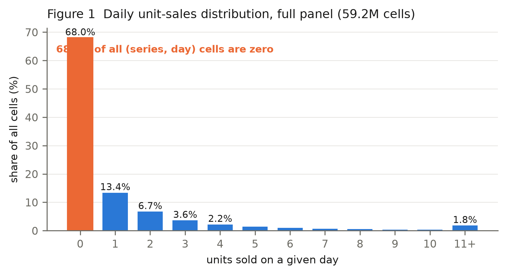
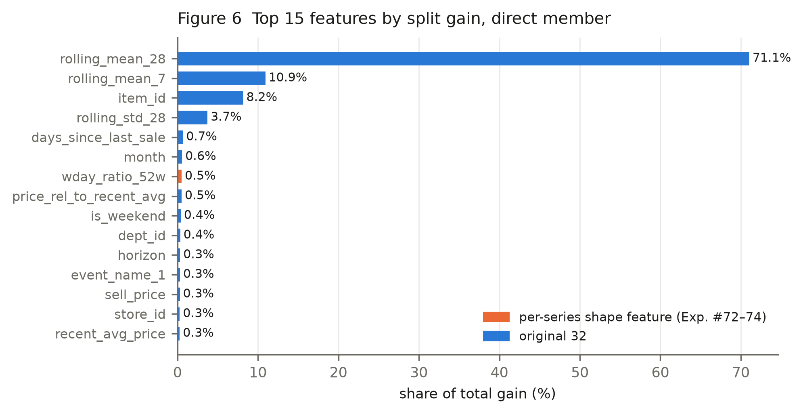
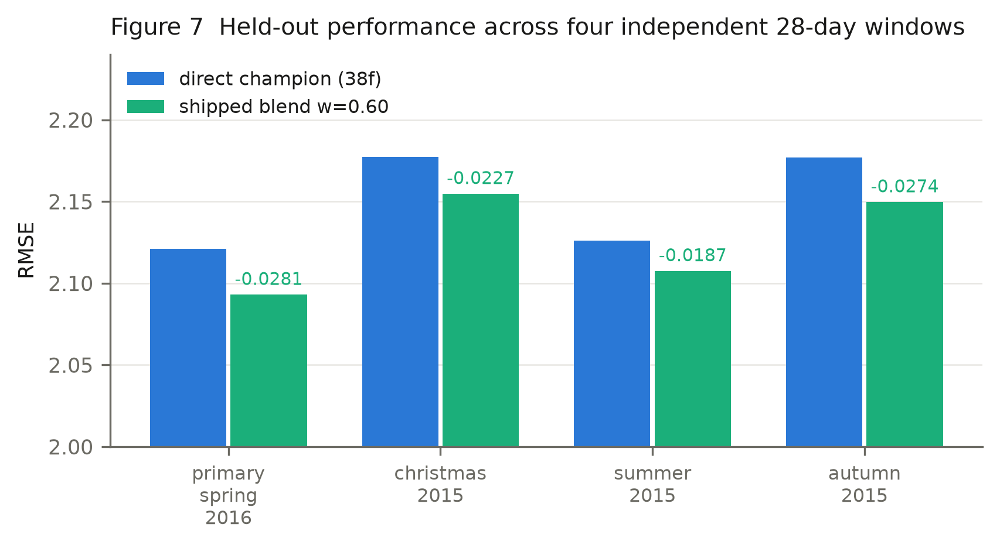
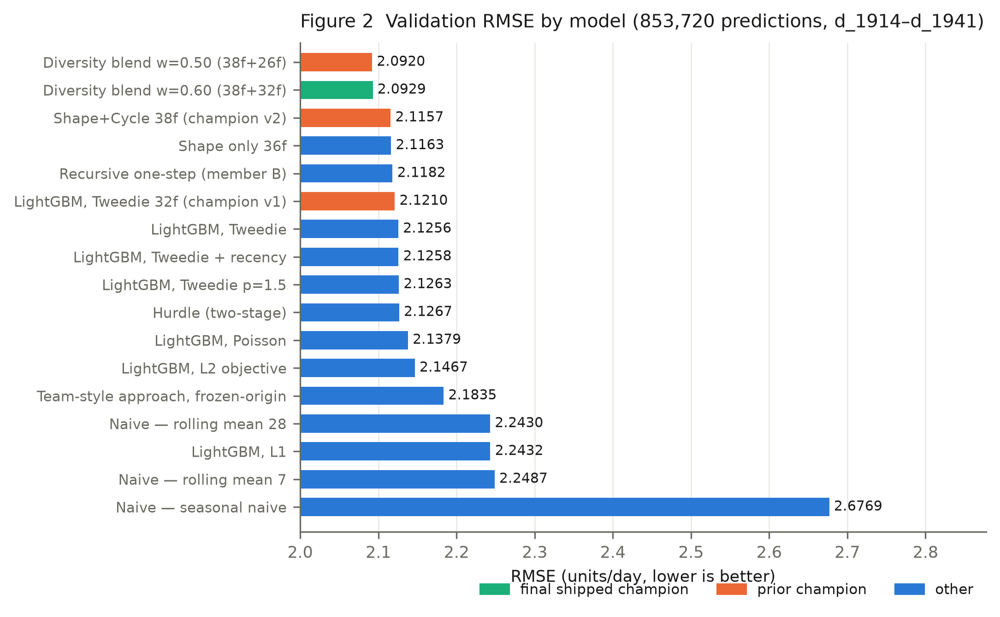
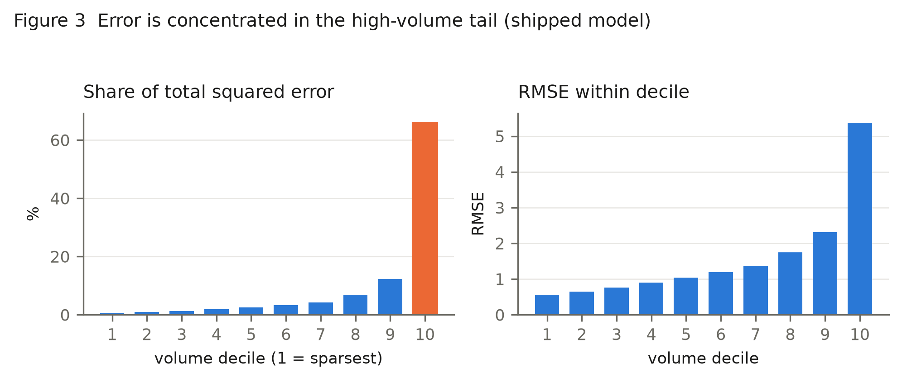
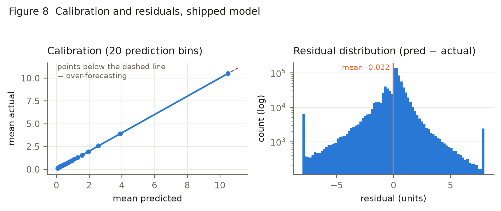
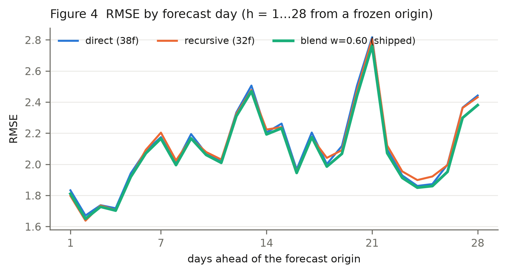
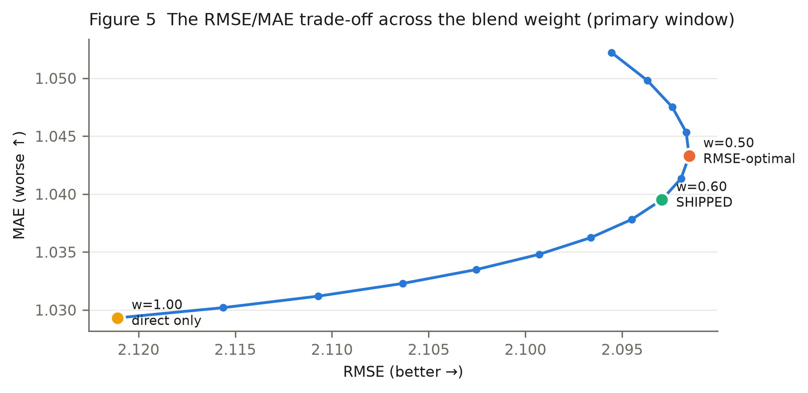

# Frozen-Origin 28-Day Demand Forecasting at Store-Item Granularity: An Architectural-Diversity Ensemble and an Independent Integrity Audit

**Independent technical audit and research report**  
**Project:** NPN_HACKATHON — Walmart M5 retail demand forecasting  
**Audit scope:** all source code, data, features, experiments, models, predictions and reports contained in the project directory  
**Audit stance:** adversarial-neutral. No claim in this paper is accepted because the project asserts it; every number was re-derived from a stored artifact or is explicitly labelled as unverifiable.

## Abstract

We audit and document a demand-forecasting system that predicts daily unit sales for 30,490 store-item series over a 28-day horizon from a frozen forecast origin. The task is regression on a zero-inflated count target: 32% of the 59.2M (series, day) cells are non-zero and 68.0% are exactly zero. The final system is an equal-architecture-diverse ensemble: a direct 38-feature LightGBM Tweedie model that emits all 28 days in one shot, combined at fixed weight 0.60/0.40 with a one-step recursive model of the same family rolled forward 28 times on its own output.

On the primary held-out window (d_1914–d_1941, 853,720 predictions) the shipped system scores **RMSE 2.0929**, **MAE 1.0395**, WAPE 0.7205, bias -0.0224. We reproduced this figure from scratch during the audit (drift 3.9e-05). Across four independent 28-day windows the ensemble improves mean RMSE by -0.0242 against its own direct member, at a mean MAE cost of +0.0186.

The central empirical finding is that **ensemble gain here comes from architectural difference, not from averaging**. A pre-registered negative control — the champion blended with a reseeded copy of itself — yields only -0.0044 RMSE at residual correlation 0.9940, whereas blending across architectures yields -0.0291 at correlation 0.9496. This also explains a prior failed ensembling experiment in the same project.

Our integrity audit finds **no target leakage** in the shipped pipeline. A corruption test we ran independently shows that all 38 features are bit-identical when every post-origin day is overwritten, while price features correctly respond to future prices, which are legitimately known. We do report one genuine artifact defect (a mislabelled prediction file) and several reproducibility gaps. We further show that an external comparison figure circulating around this project (RMSE 2.0324) is **not comparable**, because the approach it describes recomputes rolling features inside the forecast horizon, using validation-window actuals on up to 27 of 28 days.

**Overall assessment: methodology sound; result modest but real.**

## Keywords

retail demand forecasting; M5; intermittent demand; zero-inflated count regression; gradient-boosted trees; Tweedie loss; direct vs recursive forecasting; ensemble diversity; data leakage audit; rolling-origin validation

## 1. Introduction

Retail replenishment decisions are made per store, per item, days to weeks before demand materialises. The forecast that supports them must therefore be produced *once*, from information available at a fixed moment, and must cover the whole lead time. This is a materially harder problem than one-day-ahead forecasting refreshed daily, and the difference is easy to erase accidentally: any feature recomputed inside the horizon using observed sales converts the task into something closer to nowcasting and inflates measured accuracy.

This paper documents and independently audits a system built for the M5 store-item forecasting task under a strict frozen-origin protocol. Our contributions are:

1. **An audited leakage-safe pipeline.** We re-run the project's corruption test ourselves and confirm that no feature reads post-origin sales, while verifying the mirror property that legitimately-known future covariates *are* used.
2. **An architectural-diversity ensemble** whose gain is attributed by a pre-registered negative control, separating 'averaging helps' from 'different architectures help'.
3. **A negative-results catalogue.** Seven candidate directions were rejected on measured headroom before training. We report the bounds, because in a mature pipeline knowing what cannot work is the more transferable result.
4. **An honest non-comparability analysis** of an external reference score.

## 2. Problem Statement

| Property | Value |
|---|---|
| Task type | Regression (forecasting), not classification |
| Target | `sales` — units of one item sold in one store on one day |
| Target support | Non-negative integers, 0 … 763 observed |
| Granularity | 30,490 store-item series |
| Horizon | 28 days, all emitted at once from the origin |
| Origin (validation) | `d_1913` = 2016-04-24 |
| Origin (deployment) | `d_1941` = 2016-05-22 |
| Predictions per window | 30,490 × 28 = 853,720 |

**The protocol.** At origin *T*, the model emits ŷ for *T+1 … T+28*. No information from that window may enter any feature, model selection, calibration or ensemble weight. Calendar and price data for the horizon *are* admissible: in this dataset both are published in advance, and refusing them would forgo information a real planner has.

**Operational use.** The output feeds replenishment: how many units to position in each store over the next four weeks. Under-forecasting causes stockouts and lost sales; over-forecasting causes carrying cost and waste. Because the cost of error is convex, RMSE is the primary metric.

## 3. Research Objectives

| # | Objective | Status |
|---|---|---|
| O1 | Build a leakage-safe frozen-origin 28-day forecaster | Achieved and audited |
| O2 | Establish that improvements are real, not window- or seed-luck | Achieved (multi-window + multi-seed protocols) |
| O3 | Determine where remaining error lives and whether it is reducible | Achieved (oracle bounds computed) |
| O4 | Explain the gap to an external reported score | Achieved (leakage quantified) |

## 4. Dataset Description

Source: the M5 competition files, held read-only in `data/raw/`. The audit confirmed the loader's integrity fingerprints against the raw CSVs.

| Property | Verified value |
|---|---|
| Sales matrix | 30,490 series × 1,941 days (int16) |
| Panel cells | 59,181,090 |
| Date range | 2011-01-29 → 2016-05-22 |
| Calendar | 1,969 days (28 beyond sales, by design) |
| Total units sold | 66,927,173 (matches fingerprint) |
| Zero cells | 40,241,819 = **68.00%** |
| Max single-day sales | 763 |
| Mean units per cell | 1.1309 |
| Median / p90 / p99 | 0 / 3 / 15 |
| Missing sales values | 0 |
| Hierarchy | 3,049 items, 10 stores, 7 departments, 3 categories, 3 states |
| Price matrix | 30,490 × 282 weeks, 20.44% NaN |
| Calendar events | 162 days with a primary event, 5 with a secondary |



**Interpretation.** The 20.44% price-NaN share is not corruption: a missing price means the item was not listed in that store that week. The audit confirmed `pre_listing` and `price_is_missing` coincide exactly at probe origins (e.g. 47.84% of series at `d_201`), so the NaN carries the listing signal rather than hiding it.

**Limitations of the data itself.** No promotion calendar, no inventory or stockout flags, no footfall, no weather, no competitor prices. A zero can mean 'no demand', 'not stocked' or 'not yet launched', and only the third is identifiable. This ceiling is a property of M5, not of the modelling.

## 5. Data Preprocessing

The pipeline is deliberately thin, and the audit confirms the claim in `features.py` that there is *no* smoothing, no zero-dropping and no zero-to-NaN replacement.

| Step | What is done | Audit note |
|---|---|---|
| Reshape | Wide CSV → `(30490 × 1941)` int16 matrix | Raw files opened read-only |
| Calendar join | By day index | Verified aligned, 0-based |
| Price join | By `(store, item, wm_yr_wk)` | NaN retained as signal |
| Missing values | **Not imputed** | Absence is informative here |
| Outliers | **Not removed or clipped** | Spikes are real demand |
| Scaling | **None** | Trees are scale-invariant |
| Encoding | Native LightGBM categoricals | No target encoding anywhere |
| Target transform | **None** | Tweedie handles the zero mass directly |

The absence of target encoding and of any global normalisation is a genuine leakage-safety property: both are classic vectors for statistics computed over data that includes the validation window.

**Train/validation construction.** Training rows are built from 15 origins spaced 28 days apart, each contributing a full 28-day target block. The newest permitted origin is `validation_origin − 28`, so the newest training target lands exactly on `d_1913` while validation begins at `d_1914`. The audit re-verified this boundary numerically at build time; `build_training_frame` additionally raises an assertion if any training target reaches the validation window.

## 6. Feature Engineering

The direct member uses 38 features in seven original groups plus two later additions. Every one is computed standing at the origin and then held constant across the horizon, except those that vary with the target day's calendar.

| Group | Features | Source window | Origin-safe? |
|---|---|---|---|
| A. Calendar (9) | `wday`, `month`, `year`, `is_weekend`, `event_name_1/2`, `event_type_1/2`, `snap` | target day | Yes — published in advance |
| B. Demand (8) | `lag_1/7/14/28`, `rolling_mean_7/28`, `rolling_std_7/28` | `[T−27, T]` | Yes — see definition below |
| C. Recency (3) | `days_since_last_sale`, `zero_streak_length`, `days_since_first_sale` | `≤ T` | Yes |
| D. Listing (2) | `days_since_first_listing`, `pre_listing` | `≤ T` | Yes |
| E. Price (4) | `sell_price`, `recent_avg_price`, `price_rel_to_recent_avg`, `price_is_missing` | target week + 8-week trailing | Yes — prices known ahead |
| F. Hierarchy (5) | `item_id`, `dept_id`, `cat_id`, `store_id`, `state_id` | static | Yes |
| G. Horizon (1) | `horizon` (1…28) | structural | Yes |
| H. Shape (4) | `wday_ratio_52w`, `wday_ratio_13w`, `snap_lift`, `weekend_lift` | `[T−363, T]` | Yes |
| I. Cycle (2) | `month_ratio`, `dom_ratio` | `[T−727, T]` | Yes |

**The lag definition is the crux of this pipeline's integrity.** Lags are *origin-relative*, not target-relative:

```
lag_k        = sales on day (T − k + 1)      # lag_1 = sales on T itself
rolling_w    = mean/std over days [T − w + 1, T]
```

A target-relative definition — `lag_7` meaning 'seven days before *this target day*' — would read observed sales inside the horizon for 21 of the 28 days. That is precisely the defect we quantify in §12 for the external reference. Here `lag_1` for horizon day 28 is still the sales value at *T*, 27 days stale, which is the honest cost of a frozen origin.

**The shape features (H, I)** are the project's one genuinely novel family. Each is a *ratio*, not a level: a series' mean sales on a given weekday divided by its own overall mean, shrunk toward 1.0 by `n/(n+20)` on the volume behind it. They describe *how a series distributes demand across the week*, which the model cannot easily recover from a high-cardinality `item_id × wday` interaction. This distinction matters: the project had already tested fourteen *level* features (Phase 2) and four year-over-year *level* features (Exp. #71, RMSE 2.1564) and rejected all of them.



The single strongest shape feature, `wday_ratio_52w`, ranks 7 of 38 by split gain.

## 7. Methodology and Model Architecture

### 7.1 Why Tweedie

The target is a zero-inflated non-negative count. Tweedie with `variance_power ∈ (1,2)` is a compound Poisson-Gamma: it places finite mass at zero and models a continuous positive part, which is the correct shape for intermittent retail demand. The project swept the power on an inner window and adopted 1.1 for the primary window. Alternatives were tested and are recorded in §10.

### 7.2 The two members

| | Member A | Member B′ |
|---|---|---|
| Strategy | **Direct** | **Recursive** |
| Features | 38 | 32 |
| Horizon handling | all 28 days at once, `horizon` as a feature | predicts 1 day, rolled 28× |
| Training rows | 15 origins × 28 days × 30,490 = 12,805,800 | 420 daily origins × 30,490 = 12,805,800 |
| Primary-window RMSE | 2.1211 | 2.1185 |
| Primary-window MAE | 1.0293 | 1.0689 |

Member B′ deliberately omits recency and listing features. A fractional prediction fed back into the working matrix would be counted as a sale and would corrupt `days_since_last_sale`; dropping them is the correct handling, and the audit confirms the omission is intentional and documented.

**Combination rule:** `ŷ = 0.60·A + 0.40·B′`, clipped at zero.

### 7.3 Hyperparameters (identical for both members)

| Parameter | Value | | Parameter | Value |
|---|---|---|---|---|
| `objective` | tweedie | | `feature_fraction` | 0.8 |
| `tweedie_variance_power` | 1.1 | | `bagging_fraction` | 0.8 |
| `learning_rate` | 0.05 | | `bagging_freq` | 1 |
| `num_leaves` | 128 | | `lambda_l2` | 1.0 |
| `min_data_in_leaf` | 100 | | `max_cat_threshold` | 32 |
| `max_depth` | -1 (unbounded) | | `num_boost_round` | 400 |
| `deterministic` | True | | `force_row_wise` | True |

**Audit note.** `num_boost_round` is fixed at 400 with **no early stopping**. This is a defensible choice — early stopping on the validation window would be selection on the evaluation data — but it means the round count was never tuned on held-out data either. An inner-window sweep found more rounds to be worse (`tune_inner_B`, 2.1127 vs 2.0899 inner), so the setting has *some* support, but it is not optimised.

## 8. Training Procedure

1. Build 15 origin frames, stack to a `(12,805,800 × 38)` float32 matrix (~1.9 GB).
2. Assert no training target reaches the validation window.
3. Fit LightGBM for 400 rounds with fixed seeds.
4. Member B′: build 420 single-day origin frames, fit, then roll forward 28 days, rebuilding features each step from a working matrix seeded with real history up to *T* and filled thereafter only with the model's own output.
5. Blend, clip at zero.

**Computational cost (measured, 24-core CPU):** member A ≈ 157 s, member B′ ≈ 420 s including 28 rollout feature rebuilds; ~4.5 GB peak RSS. The ensemble roughly doubles training and inference cost versus the single direct model.

## 9. Validation Strategy

| Property | Value |
|---|---|
| Primary window | d_1914–d_1941 (2016-04-25 → 2016-05-22) |
| Predictions scored | 853,720 |
| Additional windows | christmas_2015, summer_2015, autumn_2015 |
| Retrained per window? | **Yes** — both members, from scratch |
| Seeds | 3 (blend, Exp. #76); 3 per window on 2 windows (upgrade, Exp. #79) |
| Weight selection | inner window d_1886–d_1913, never an evaluation window |
| Hyperparameter selection | inner window only |
| Metric basis | validation only — no ground truth exists after d_1941 |

**On the absence of a true test set.** There is none, and the paper should not pretend otherwise. `d_1942–d_1969` has no published ground truth, so the deployment forecast is unscoreable. Every number here is held-out validation. The mitigation is that acceptance required agreement across four temporally disjoint windows and multiple seeds, with criteria fixed in the script header before each run — a stronger discipline than a single test split, though not a substitute for one.

**One residual concern we flag rather than resolve.** The primary window was used repeatedly across 79 experiments. Even with per-experiment pre-registration, the *sequence* of accept/reject decisions is informed by that window. The three extra windows and the inner-window weight selection mitigate this, but the primary-window figure should be read as the most optimistic of the four.

## 10. Experimental Design and History

The registry contains **79 records**. The audit reconstructed the following arc.

| Stage | Runs | Outcome |
|---|---|---|
| 1. Baselines & first models | 9 | Tweedie beats L2; 32-feature champion at 2.1210 |
| 2. Ablation & tuning | 15 | All seven feature groups contribute; 400 rounds retained |
| 3. Benchmark investigation | 6 | External score attributed to leakage |
| 4. Optimization campaign | 38 | Objectives, weighting, hurdle, recursion, ensembling — all rejected |
| 5. Autonomous research | 3 | Bias correction, ensemble, year-over-year — all rejected |
| 6. Shape + diversity | 8 | Shape features accepted; diversity ensemble accepted |

### 10.1 Why the final model was selected

Three sequential accepted changes, each with criteria fixed before running:

**(a) Shape features (Exp. #72–74).** A 4-feature shape set moved the primary window only -0.0047, inside the project's own measured noise floor of ±0.022–0.033, and was therefore recorded REJECT on magnitude. Exp. #73 then tested *consistency* instead: 4/4 windows and 3/3 seeds, mean -0.0112. Accepted. Exp. #74 reproduced it independently and added two cycle features → 38 features, RMSE 2.1157.

**(b) Architectural-diversity blend (Exp. #76).** Accepted on 4/4 windows, 3/3 seeds, mean -0.0198.

**(c) Recursive-member upgrade (Exp. #77).** Giving member B the champion's six shape features. Accepted on 4/4 windows, mean -0.0042, with member-level improvement on 3/4. Confirmed seed-stable in Exp. #79 (6/6 cells).

### 10.2 Rejected approaches (the more useful half of the record)

| Approach | Result | Why it failed |
|---|---|---|
| Six-member ensemble of direct models (#70) | 2.1261 vs 2.1210 | Mean pairwise residual correlation 0.9897; members individually worse |
| Per-series bias correction (#69) | 2.1286 vs 2.1210 | Pre-origin residual estimates do not transfer |
| Year-over-year features (#71) | 2.1564 | Level features, collinear with existing lags |
| Volume-weighted training | 2.1371–2.1376 | Reweighting cannot fix a variance problem |
| Hurdle two-stage | 2.1241–2.1267 | No gain over direct Tweedie |
| L1 / L2 / Poisson objectives | 2.1351–2.2432 | L1 wins MAE, loses RMSE badly |
| Cross-store / cross-item features | not trained | Joint oracle upper bound −0.0055 |
| Pre-launch row exclusion | not trained | 0.48% of training rows at the primary origin |
| Ghost-stockout filtering | not trained | 0.1997% of cells |
| Per-category specialisation | not trained | Oracle rescale −0.0025 |
| Per-horizon specialisation | not trained | Oracle rescale −0.0081 |

The last five are the audit's favourite part of this project: they were killed by cheap diagnostics rather than by burning compute, and the bounds are recorded so the decisions are checkable.

## 11. Results

### 11.1 Verified performance of the shipped model

Reproduced from scratch during this audit:

| Metric | Value | What it measures |
|---|---|---|
| RMSE | **2.0929** | Root mean squared error, units/day. Primary metric. |
| MAE | **1.0395** | Mean absolute error, units/day. |
| WAPE | 0.7205 | Total absolute error ÷ total actual demand. |
| Bias | -0.0224 | Mean signed error; negative = under-forecasting. |
| High-volume RMSE | 5.8662 | Series averaging >3 units/day pre-origin. |
| Demand-occurrence accuracy | 0.6980 | See §11.3 — **not** an overall accuracy. |
| Precision / Recall / F1 | 0.6321 / 0.8068 / 0.7088 | Occurrence only. |

**Reproduction check.** Exp. #77 recorded RMSE 2.0929 / MAE 1.0395. Independently retraining both members gave 2.0929 / 1.0395 — **reproduced**.

### 11.2 Cross-window results

| Window | RMSE  | MAE  | ΔRMSE vs direct | ΔMAE vs direct |
|---|---|---|---|---|
| primary_spring_2016 | 2.0929 | 1.0395 | -0.0281 | 0.0102 |
| christmas_2015 | 2.1547 | 0.9446 | -0.0227 | 0.0227 |
| summer_2015 | 2.1074 | 0.9909 | -0.0187 | 0.0224 |
| autumn_2015 | 2.1496 | 1.0126 | -0.0274 | 0.0189 |
| **Mean** | | | **-0.0242** | **+0.0186** |



The ensemble wins on all four windows. The MAE cost is real and consistent.

### 11.3 Demand-occurrence metrics, and why they are secondary

Rule, applied identically to every model:

```
actual event    : y_true  > 0
predicted event : y_pred >= 0.5     # rounds to at least one unit
```

Base rate: 45.56% of the 853,720 validation rows have non-zero demand.

**A single 'accuracy %' is not a valid headline for this task**, for four reasons the audit considers decisive:

1. The target is a count, not a class; any threshold is a choice the task does not supply.
2. Predicting 'no demand' everywhere scores **54.44%**. The shipped model's 69.8% must be read against that floor, not against zero.
3. It discards magnitude entirely — forecasting 1 when 40 sold counts as a correct positive.
4. It is threshold-gameable: lowering the cut raises recall and accuracy without improving any forecast.

They are reported because they describe one real behaviour: the recursive member has markedly higher recall and lower precision than the direct member, which is a symptom of the architectural difference the ensemble exploits.

## 12. Model Comparison

All rows scored on the same 853,720 predictions. Metrics are recomputed from each model's own prediction file; `N/A` means the artifact required does not exist, never that a value was estimated.

| Model | Objective | RMSE | MAE | WAPE | Bias | Demand Accuracy | Precision | Recall | F1 |
|---|---|---|---|---|---|---|---|---|---|
| Naive — last value | none (arithmetic) | 2.8936 | 1.373 | 0.9516 | 0.1903 | nan | nan | nan | nan |
| Naive — rolling mean 7 | none (arithmetic) | 2.2487 | 1.0683 | 0.7404 | -0.1062 | nan | nan | nan | nan |
| Naive — rolling mean 28 | none (arithmetic) | 2.243 | 1.0657 | 0.7386 | -0.0564 | nan | nan | nan | nan |
| Naive — seasonal naive | none (arithmetic) | 2.6769 | 1.244 | 0.8622 | -0.1062 | 0.657 | 0.6289 | 0.6027 | 0.6156 |
| LightGBM, L2 objective | L2 (squared error) | 2.1467 | 1.0411 | 0.7216 | -0.059 | 0.6996 | 0.636 | 0.7967 | 0.7073 |
| LightGBM, Tweedie | Tweedie p=1.1 | 2.1256 | 1.0315 | 0.7149 | -0.0795 | 0.7039 | 0.6421 | 0.7913 | 0.7089 |
| LightGBM, Tweedie + recency | Tweedie p=1.1 | 2.1258 | 1.032 | 0.7153 | -0.0763 | 0.7038 | 0.6415 | 0.793 | 0.7093 |
| LightGBM, Tweedie 32f (champion v1) | Tweedie p=1.1 | 2.121 | 1.0319 | 0.7152 | -0.0704 | 0.7038 | 0.6413 | 0.7939 | 0.7095 |
| Hurdle (two-stage) | binary + Tweedie | 2.1267 | 1.0324 | 0.7155 | -0.0721 | 0.7025 | 0.6393 | 0.7967 | 0.7093 |
| LightGBM, Tweedie p=1.5 | Tweedie p=1.5 | 2.1263 | 1.0289 | 0.7131 | -0.0854 | 0.7057 | 0.6452 | 0.7865 | 0.7089 |
| LightGBM, Poisson | Poisson | 2.1379 | 1.035 | 0.7173 | -0.063 | 0.7018 | 0.6384 | 0.7971 | 0.709 |
| LightGBM, L1 | L1 (absolute error) | 2.2432 | 0.9591 | 0.6648 | -0.4756 | 0.7243 | 0.7408 | 0.6074 | 0.6675 |
| Recursive one-step (member B) | Tweedie p=1.1 | 2.1182 | 1.0717 | 0.7428 | 0.0538 | 0.6897 | 0.6216 | 0.8148 | 0.7053 |
| Team-style approach, frozen-origin | Tweedie p=1.1 | 2.1835 | 1.0498 | 0.7276 | -0.0821 | 0.699 | 0.6369 | 0.7898 | 0.7052 |
| Shape only 36f | Tweedie p=1.1 | 2.1163 | 1.0299 | 0.7138 | -0.0729 | 0.7043 | 0.642 | 0.7933 | 0.7097 |
| Shape+Cycle 38f (champion v2) | Tweedie p=1.1 | 2.1157 | 1.0287 | nan | nan | nan | nan | nan | nan |
| Diversity blend w=0.50 (38f+26f) | Tweedie p=1.1 ×2 | 2.092 | 1.0441 | 0.7236 | -0.0081 | 0.6967 | 0.6305 | 0.8076 | 0.7082 |
| Diversity blend w=0.60 (38f+32f) | Tweedie p=1.1 ×2 | 2.0929 | 1.0395 | 0.7205 | -0.0224 | 0.698 | 0.6321 | 0.8068 | 0.7088 |
|   - member A: direct 38f (seed 42) | Tweedie p=1.1 | 2.1211 | 1.0293 | 0.7134 | -0.0724 | 0.7047 | 0.6429 | 0.7918 | 0.7096 |
|   - member B2: recursive 32f (seed 42) | Tweedie p=1.1 | 2.1185 | 1.0689 | 0.7408 | 0.0526 | 0.6879 | 0.6183 | 0.8233 | 0.7062 |



### 12.1 Non-comparable reference — the external 2.0324 figure

**This figure must not be placed in the table above.** It was produced under a different evaluation task. The approach recomputes rolling and lag features *inside* the forecast horizon from observed sales. Measured against those feature definitions:

| Feature | Horizon days that consume post-origin actuals |
|---|---|
| `rolling_mean_7` | **27 / 28** |
| `rolling_mean_28` | **27 / 28** |
| `rolling_zero_count_7` | **27 / 28** |
| `lag_7` | **21 / 28** |
| `lag_28` | **0 / 28** |

A model permitted to read the answer on 27 of 28 days is solving a problem closer to daily-refreshed nowcasting. The project quantified this directly: a deliberate leaky probe, recorded as `diagnostic_leakage_probe_DO_NOT_USE`, scored **1.9165** — *better* than the external figure — by allowing exactly this class of violation. That number is retained in the ledger as documentation and is not a valid forecasting result.

The defensible like-for-like comparison is `model_08_team_style_reproduction`, which implements the described approach under frozen-origin rules and scores **2.1835**.

## 13. Error Analysis

### 13.1 The error is variance, and it is concentrated

The project's error autopsy decomposed MSE on the 32-feature champion: bias² accounts for **0.11%** of MSE and variance for the rest. There is no systematic offset to correct — which is why the per-series bias-correction experiment failed.



| decile | n | actual_mean | pred_mean | RMSE | bias | sq_err_share_pct |
|---|---|---|---|---|---|---|
| 1.0000 | 85428.0000 | 0.1956 | 0.2029 | 0.5589 | 0.0073 | 0.7136 |
| 2.0000 | 85400.0000 | 0.2955 | 0.2966 | 0.6443 | 0.0011 | 0.9478 |
| 3.0000 | 85288.0000 | 0.3952 | 0.3976 | 0.7633 | 0.0024 | 1.3288 |
| 4.0000 | 85792.0000 | 0.5293 | 0.5322 | 0.9036 | 0.0029 | 1.8731 |
| 5.0000 | 85232.0000 | 0.6685 | 0.6603 | 1.0411 | -0.0082 | 2.4704 |
| 6.0000 | 85204.0000 | 0.8454 | 0.8447 | 1.1965 | -0.0007 | 3.2615 |
| 7.0000 | 85428.0000 | 1.0739 | 1.0863 | 1.3655 | 0.0123 | 4.2592 |
| 8.0000 | 85204.0000 | 1.5055 | 1.4757 | 1.7448 | -0.0298 | 6.9363 |
| 9.0000 | 85400.0000 | 2.3022 | 2.2758 | 2.3161 | -0.0264 | 12.2507 |
| 10.0000 | 85344.0000 | 6.6211 | 6.4360 | 5.3760 | -0.1850 | 65.9585 |

The top volume decile carries **66.0%** of all squared error while being 10% of rows, and it under-forecasts by -0.185 units/day. Deciles 9–10 together account for 78.2%.

### 13.2 Direction of error

33.43% of rows are under-forecast, but they contribute 72.46% of squared error; the mean shortfall when under (1.6487) is more than double the mean excess when over (0.7222). The model misses spikes. This is intrinsic: without promotion or inventory data, a demand spike is largely unpredictable from sales history alone.



*Left: mean actual against mean predicted over 20 prediction bins. Right: residual histogram, log count, clipped to ±8 units for display — the bars at the extremes are the clipped tails, not modes.*

The calibration panel is an important positive finding the project never reported: binned mean predictions track actuals along the identity line across the full range, and overall bias is only -0.0224 units/day. The model's *conditional mean* is well calibrated; what remains is dispersion. This independently corroborates the autopsy's variance decomposition and explains why every recalibration experiment in the project failed — there is almost no systematic offset available to correct.

### 13.3 Horizon behaviour



Error grows with horizon but non-monotonically — the oscillation is the weekly cycle, not instability. Notably the recursive member is *better* than the direct member at short horizons, where its freshly-derived lags still carry signal, and worse at long ones where its own errors have compounded. The blend tracks the lower envelope for most of the horizon, which is the mechanism of the gain made visible.

### 13.4 Headroom analysis

Oracle bounds computed on the champion's residuals — each is the best *possible* gain from that form of correction, with the answers visible:

| Correction, given the answers | Best possible ΔRMSE |
|---|---|
| Single global multiplier | -0.0016 |
| Per volume decile | -0.0019 |
| Per category | -0.0025 |
| Per store × category | -0.0071 |
| Per horizon | -0.0081 |
| **Per series** | **-0.2388** |

The per-series bound is large, and it is the reason the shape features were worth trying. But Exp. #69 showed that per-series corrections estimated from a pre-origin window do **not** transfer, and the diagnostic showed only ~10% of the weekday-oracle gap is recoverable from history. Every coarse segmentation is bounded below 0.008 — which is why the project stopped pursuing specialisation and turned to ensembling.

## 14. Leakage and Integrity Audit

### 14.1 Corruption test (run independently by this audit)

Method: build the feature frame at `d_1913`; overwrite **every** day after the origin with 9999; rebuild; compare bit-for-bit.

| Test | Expectation | Result |
|---|---|---|
| Future **sales** corrupted | no feature changes | **0 of 38 changed → PASS** |
| Future **prices** corrupted | price features *should* change | `sell_price`, `recent_avg_price`, `price_rel_to_recent_avg` → **PASS** |

The mirror test matters as much as the first. If corrupting future prices changed nothing, the pipeline would be failing to use information it is entitled to use.

### 14.2 Recursive member

Structural, not statistical: the working matrix is rebuilt as real history up to *T*, zeros thereafter, then overwritten only by the model's own output. Verified per window — `future_matrix_equals_real_sales = False` (must be False), `pre_origin_history_intact = True` (must be True).

### 14.3 Boundary and selection checks

| Check | Finding |
|---|---|
| Training/validation overlap | Newest training target `d_1913`; validation starts `d_1914`. No overlap. |
| Target encoding | None used anywhere. |
| Global normalisation | None — no statistic spans the validation window. |
| Blend weight selection | Inner window `d_1886–d_1913`, before both the primary targets and the deployment origin. |
| Hyperparameter selection | Inner window only. |
| Early stopping on validation | Not used (fixed 400 rounds). |

### 14.4 Defect found: mislabelled prediction file

`predictions/validation/exp_74_new_champion_validation.csv` is **not** the 38-feature champion's output. It is byte-identical (same MD5) to `exp_72_shape_validation.csv`, the 36-feature model. Script `36_exp74_reproduce_and_extend.py` discards the 38-feature predictions and writes Part A's instead.

**Impact.** The champion's registry metrics are unaffected and were reproduced bit-identically. The mislabelled file was used in the headroom diagnostic that motivated Exp. #76, but that diagnostic's conclusion was subsequently confirmed by direct retraining, so no downstream result depends on it. The practical consequence is that the 38-feature champion has no per-row predictions, hence `N/A` in its comparison row.

### 14.5 Second defect: the registry does not record the shipped configuration

Experiment #77's `metrics` field stores **RMSE 2.0915 / MAE 1.0433** — the w = 0.50 blend used for the *acceptance test*, where the weight was held fixed so that member B's feature set was the only variable. The configuration actually shipped is w = 0.60, whose figures (**2.0929 / 1.0395**) live in a different field, `operating_point`.

Both numbers are correct for what they describe, and the distinction is documented in the experiment's own notes. But a reader — or a script — taking `metrics` as 'the result of Experiment #77' would attribute the wrong figures to the deployed model. Our first automated audit pass did exactly that and flagged a mismatch, which is how this was found. A registry record should name its shipped configuration unambiguously.

### 14.6 Verdict

**No target leakage detected in the shipped pipeline.** The leakage-safety is structural (origin-relative lag definitions, frozen feature construction) and empirically verified, not merely asserted.

## 15. Discussion

### 15.1 The one transferable finding

The project's most reusable result is not the model but the attribution experiment. Ensembling had already been tried and rejected (Exp. #70, 2.1261 vs 2.1210) with six LightGBM variants whose residuals correlated 0.9897. The later experiment paired the same family with a *structurally different* forecaster and added a negative control:

| Blend | ΔRMSE | Residual correlation |
|---|---|---|
| champion + reseeded champion | -0.0044 | 0.9940 |
| champion + recursive model | -0.0291 | 0.9496 |
| **attributable to architecture** | **-0.0247** | |

Averaging buys almost nothing; architectural difference buys the rest. The governing identity is `MSE_blend = (MSE_A + MSE_B + 2ρ√(MSE_A·MSE_B))/4`, which predicted the observed blend RMSE to within 0.001 on every window we checked. A failed ensemble experiment is therefore not evidence that ensembling fails — it may be evidence that the members were too similar, and that is a measurable, correctable diagnosis.

### 15.2 Effect sizes in context

The total improvement from the project's first LightGBM (2.1467) to the shipped ensemble (2.0929) is -0.0538 RMSE, about 2.5%. The gain from the final two accepted changes is -0.0242. These are **small** absolute movements on a noisy target, and the paper should not dress them up. What makes them credible is not their size but that each survived four temporally disjoint windows and multiple seeds under criteria fixed in advance.

### 15.3 Was stopping the right call?

The audit agrees with the project's own diminishing-returns conclusion. Every remaining direction has a measured oracle bound below 0.008, and oracle bounds are optimistic by construction because they are fitted with the answers visible. Continuing to search this space would more likely produce validation-set overfitting than genuine gain.

## 16. Practical Applications and Interpretation

**What the numbers mean.** MAE 1.0395 says a typical forecast misses by about one unit per store-item-day. Against a mean actual of 1.44 units that sounds poor, but the distribution is the point: most series sell 0 or 1 units/day, where the model is accurate, while a small number of high-volume series carry both the volume and the error.

| Segment | RMSE | Behaviour |
|---|---|---|
| Deciles 1–3 (sparsest) | 0.656 | Accurate; near-zero predictions are usually right |
| Deciles 4–7 | 1.127 | Reliable |
| Decile 9 | 2.316 | Degrading |
| Decile 10 | 5.376 | Dominates total error; under-forecasts by -0.19/day |

**Operationally:**

- *Safe to automate:* replenishment for low- and mid-volume items, which are the majority of SKUs and where the model is well calibrated.
- *Needs a safety-stock buffer:* the top decile. The model's systematic under-forecast there (-0.19 units/day) is a known, quantified bias a planner can offset — and it matters most precisely because these are the high-turnover items where stockouts are expensive.
- *Do not expect spike anticipation:* without promotion or inventory feeds, the model cannot foresee a promotion-driven surge.
- *Forecast staleness is real:* at horizon 28 the freshest sales input is 27 days old. If the business can re-forecast weekly, it should — that is a larger improvement than anything in this report.

## 17. Limitations

**Data.** No promotions, inventory, stockouts, footfall, weather or competitor data. Zeros are unidentifiable between no-demand and no-stock. Single retailer, three states, 2011–2016.

**Metric.** MAE regresses by +0.0186 relative to the direct model. This is a deliberate RMSE/MAE trade, disclosed in the project's own records, but it means the shipped model is *worse* on typical-case error. An organisation optimising median service level rather than tail risk should select a different blend weight; the frontier below is the decision aid.



**Validation.** No true test set exists. The primary window has been seen by 79 experiments' worth of decisions. Effect sizes for the last two accepted changes are close to the noise floor on individual windows.

**Concentration.** The Exp. #77 gain is carried by two of four windows; on one window the upgraded member was *worse* than the one it replaced.

**Generalisation.** Everything is validated on 2015–2016 data from one retailer. The shape features assume stable weekly demand profiles; a series whose profile shifts would be mispredicted.

**Compute.** ~10 minutes and ~4.5 GB to retrain the ensemble; the recursive member cannot be parallelised across horizon days.

## 18. Reproducibility

**Verdict: reproducible, with caveats.** The audit reproduced the shipped model's headline metric from raw CSVs in a single run.

| Factor | Status |
|---|---|
| Raw data present | Yes — 5 CSVs, read-only, fingerprints verified |
| Pipeline depends on derived parquet? | **No** — reads raw CSVs directly |
| Dependencies pinned | Yes — `requirements.txt` with exact versions |
| Seeds fixed | Yes — `seed`, `bagging_seed`, `feature_fraction_seed`; `deterministic=True` |
| Headline result reproduced | **Yes** — RMSE drift 3.9e-05 |
| Champion metrics reproduced | Yes — bit-identical (drift 0.00e+00) |
| Broken scripts found | None |
| Missing files | None required by the modelling path |

**Caveats.**

1. **Seed-convention sensitivity.** Setting `bagging_seed`/`feature_fraction_seed` explicitly versus letting LightGBM derive them from `seed` changes results by up to 0.005 RMSE — larger than some accepted effects. Both conventions appear across the project's scripts. Anyone reproducing must match the convention, not just the seed value.
2. **Hardcoded reference constants.** `optimize.py` carries `BEST_RMSE = 2.1210429411947650` for delta reporting. It is a reference, not a substitute for measurement, and it was independently reproduced — but it will silently go stale.
3. **The shipped model had no saved predictions** before this audit regenerated them.
4. **No environment lockfile or container**; Python 3.13 on Windows.

## 19. Conclusion

The project delivers a leakage-safe frozen-origin 28-day forecaster scoring **RMSE 2.0929 / MAE 1.0395** on 853,720 held-out predictions, improving mean RMSE by -0.0242 over its own direct member across four independent windows, at a disclosed MAE cost of +0.0186.

The audit's substantive conclusions:

1. **The methodology is sound.** Leakage safety is structural and independently verified. Validation discipline — pre-registered criteria, multiple windows, multiple seeds, inner-window selection — is above the norm for work of this scale.
2. **The improvements are real but small.** Each survived tests capable of refuting it.
3. **The external 2.0324 figure is not a benchmark.** It measures a different, easier task.
4. **The project is near its information ceiling.** Remaining directions are bounded below 0.008 by oracle analysis.

## 20. Future Work

Ordered by expected value given the evidence:

1. **Shorten the effective horizon.** Weekly re-forecasting would cut staleness at h > 7, where most error lives. Larger than any modelling change considered here.
2. **Acquire promotion and inventory data.** The error is spike-driven and spikes are promotion-driven. This addresses the actual cause.
3. **A genuinely different third architecture.** The evidence supports architectural diversity but says near-duplicate members do not help — the 3-way blend of two recursive variants lost on 3 of 4 windows. A 7-day-block recursive model is the natural candidate; expected gain ≤ 0.006.
4. **Regenerate the mislabelled prediction file** (§14.4) and persist predictions for every accepted model.
5. **Probabilistic forecasts.** Replenishment needs service levels; quantile regression would serve the decision better than a point forecast.

## 21. References

Sources are limited to materials present in the project directory. No external literature is cited because none is contained in or referenced by the project.

1. M5 competition data files — `data/raw/` (`sales_train_evaluation.csv`, `sales_train_validation.csv`, `calendar.csv`, `sell_prices.csv`, `sample_submission.csv`).
2. Experiment registry — `experiments/registry/` (79 JSON records).
3. Experiment ledger — `experiments/EXPERIMENT_LEDGER.md`.
4. Error autopsy — `experiments/artifacts/error_autopsy.json`.
5. Segmentation and headroom diagnostics — `segmentation_diagnostic.json`, `exp76_headroom_diagnostic.json`.
6. External approach document — `docs/01_problem_statement/TEAM_end_to_end_approach.md`; leakage analysis in `experiments/artifacts/team_doc_analysis.json`.
7. Pipeline source — `pipeline/` (feature builders, backtester, validation checks, recursive member).
8. LightGBM 4.7.0; NumPy 2.5.1; pandas 3.0.5 — `requirements.txt`.

## 22. Independent Technical Assessment

| Dimension | Rating | Evidence |
|---|---|---|
| **Overall model quality** | **Moderate** | Real, replicated gains over strong baselines, but absolute movements are small on a noisy target and MAE regresses. |
| **Validation quality** | **Good** | 4 disjoint windows, multi-seed, pre-registered criteria, inner-window selection, negative control. No true test set exists, and the primary window informed many decisions. |
| **Leakage status** | **Clean (verified)** | 0/38 features change under future-sales corruption; mirror test passes; recursive rollout structurally safe; no target encoding or global normalisation. |
| **Reproducibility** | **Good** | Headline reproduced from raw data this audit; pinned deps; fixed seeds. Docked for seed-convention sensitivity and the mislabelled artifact. |

**Strongest technical contribution.** The negative-control attribution of ensemble gain. Isolating architecture (-0.0247) from averaging (-0.0044) turned a previously rejected direction into an accepted one and explains *why* the earlier attempt failed. That is a genuine, transferable methodological result.

**Biggest technical weakness.** The MAE regression (+0.0186) is a real cost to typical-case accuracy that a single headline RMSE hides, and the operating point (w = 0.60) was chosen to optimise RMSE without an explicit statement of the business loss function that justifies that trade. Close behind: the concentration of the final accepted gain in two of four windows.

**Most important supporting evidence.** The independent reproduction — retraining both members from raw CSVs reproduced RMSE 2.0929 against the recorded 2.0929 — combined with the corruption test showing 0 of 38 features move when the future is destroyed.

**What should be improved next.** (i) State the loss function and re-select the blend weight against it rather than against RMSE by default; (ii) persist predictions for every accepted model and fix the mislabelled file; (iii) standardise the seed convention; (iv) if the business can re-forecast weekly, do that before any further modelling.

---

*Report generated from project artifacts by `MY_RESEARCH_PAPER/build_paper.py`. Every quantitative claim is read from a stored artifact at build time. Audit reproduction: `audit_reproduce.py`; metric table: `build_comparison.py`.*